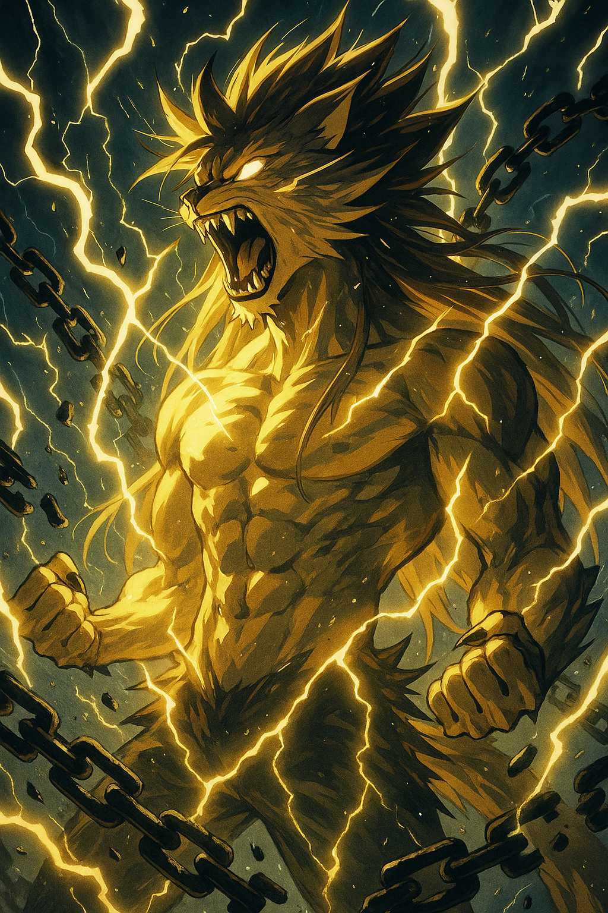

# Rizz Power-Up Frontend ✨💻

> *"The frontend is where the digital energy of rizz manifests into visual harmony."*

## Overview 🌈

This directory contains the React frontend application for the Rizz Power-Up Simulator. Built with React, TypeScript, and Vite, it delivers a vaporwave-inspired experience that allows users to tap a button to increase their "Rizz" level.



## Tech Stack 🔮

| Category | Technology |
|----------|------------|
| **Framework** | React 19 + TypeScript |
| **Styling** | TailwindCSS 4.1.5 |
| **Build Tool** | Vite 6.3.1 |
| **Package Manager** | pnpm |
| **State Management** | React Hooks + Context |
| **Media Handling** | Custom optimized resource loader |

## Development 🧙‍♂️

### Setup

```bash
# Navigate to the frontend directory
cd apps/frontend

# Install dependencies
pnpm install

# Start the development server
pnpm dev
```

The development server will be available at `http://localhost:5173` by default.

### Available Scripts

```bash
# Start development server
pnpm dev

# Build for production
pnpm build

# Preview production build
pnpm preview

# Run linter
pnpm lint
```

## Project Structure 🏗️

```
frontend/
├── public/           # Static assets
│   ├── buttons/      # Button images
│   ├── logos/        # Logo assets
│   ├── memes/        # Card images
│   ├── sounds/       # Audio files
│   └── video/        # Video files
├── src/              # Source code
│   ├── components/   # React components
│   ├── hooks/        # Custom React hooks
│   ├── utils/        # Utility functions
│   ├── App.tsx       # Main application component
│   └── main.tsx      # Application entry point
└── index.html        # HTML entry point
```

## Key Features 🚀

- **Vaporwave Aesthetic**: Neon colors, retro grid backgrounds, and nostalgic design elements
- **Responsive Design**: Adapts to all screen sizes for optimal mobile and desktop experience
- **Optimized Media Loading**: Preloads and caches images, sounds, and videos for smooth performance
- **Interactive Animations**: Dynamic animations that respond to user interactions
- **Local Storage**: Saves user progress between sessions

## Styling Guidelines 🎨

This project follows the styling guidelines defined in the [Style Guide](../../style-guide.md). Key points:

- Use TailwindCSS for styling
- Follow the defined color palette for consistency
- Implement animations that feel organic and natural
- Use emojis sparingly to enhance the user experience

## Contributing 🌱

When contributing to the frontend:

1. Follow the established code structure
2. Maintain the vaporwave aesthetic
3. Ensure responsive design across all devices
4. Optimize for performance, especially with media assets

---

*Crafted with conscious code & single-origin coffee* ☕✨

## 📚 Documentation

For complete project documentation, please see the [Table of Contents](../../TOC.md) which provides links to all documentation files in this project.
