# Meme Converter Utility 🖼️✨

> *"The transformation of visual energy into digital rizz manifestations."*

## Overview 🌈

This utility converts meme image prompts into TypeScript files that can be used by the Rizz Power-Up Simulator frontend. It processes the prompt descriptions and image filenames to create a structured data format that the application can easily consume.

```mermaid
%%{init: {'theme': 'base', 'themeVariables': { 'primaryColor': '#9B5DE5', 'primaryTextColor': '#fff', 'primaryBorderColor': '#7C3AEF', 'lineColor': '#00F5D4', 'secondaryColor': '#F15BB5', 'tertiaryColor': '#00BBF9' }}}%%
flowchart LR
    A[📝 Markdown Prompts] --> B[🔄 Meme Converter]
    C[📁 Image Files] --> B
    B --> D[📊 TypeScript Output]
    
    style A fill:#F15BB5,stroke:#333,stroke-width:2px
    style B fill:#9B5DE5,stroke:#333,stroke-width:2px
    style C fill:#F15BB5,stroke:#333,stroke-width:2px
    style D fill:#00BBF9,stroke:#333,stroke-width:2px
```




## Functionality 🔮

The meme converter:

1. Reads prompt descriptions from `apps/frontend/public/memes/rizz_image_prompts_no_text_overlay.md`
2. Scans the `apps/frontend/public/memes/good` and `apps/frontend/public/memes/bad` directories for image files
3. Matches prompts with their corresponding images
4. Generates a TypeScript file (`memeImages.ts`) with structured data for the frontend

## Usage 🧙‍♂️

```bash
# Navigate to the meme-converter directory
cd apps/meme-converter

# Install dependencies
npm install

# Run the converter
npm start
```

The generated output will be saved to `apps/frontend/src/memeImages.ts`.

## Generated Output 📊

The converter generates a TypeScript file with the following structure:

```typescript
export interface MemeImage {
  id: string;
  filename: string;
  description: string;
  isGood: boolean;
  attributes: {
    vibe: number;
    swagger: number;
    cringeAvoidance: number;
  };
}

export const memeImages: MemeImage[] = [
  // Array of meme image objects
];

export const goodMemeImages: MemeImage[] = [
  // Array of good meme image objects
];

export const badMemeImages: MemeImage[] = [
  // Array of bad meme image objects
];
```

## Configuration ⚙️

The converter uses the following configuration:

- **Source Markdown**: `apps/frontend/public/memes/rizz_image_prompts_no_text_overlay.md`
- **Good Images Directory**: `apps/frontend/public/memes/good`
- **Bad Images Directory**: `apps/frontend/public/memes/bad`
- **Output File**: `apps/frontend/src/memeImages.ts`

## Development 🛠️

When modifying the converter:

1. Ensure it correctly parses the markdown format
2. Maintain the attribute generation logic
3. Keep the TypeScript interface consistent with frontend expectations
4. Add appropriate error handling for missing files or malformed input

---

*Crafted with conscious code & single-origin coffee* ☕✨

## 📚 Documentation

For complete project documentation, please see the [Table of Contents](../../TOC.md) which provides links to all documentation files in this project.