# Rizz Power-Up Infrastructure ☁️✨

> *"Infrastructure is the digital foundation upon which the rizz energy flows."*

## Overview 🌐

This directory contains the infrastructure-as-code configuration for the Rizz Power-Up Simulator app. Using OpenTofu (a Terraform alternative), we've created a scalable, reliable cloud infrastructure on AWS to host our vaporwave masterpiece.

```mermaid
%%{init: {'theme': 'base', 'themeVariables': { 'primaryColor': '#9B5DE5', 'primaryTextColor': '#fff', 'primaryBorderColor': '#7C3AEF', 'lineColor': '#00F5D4', 'secondaryColor': '#F15BB5', 'tertiaryColor': '#00BBF9' }}}%%
flowchart TD
    A[🌐 User Browser] --> B[☁️ CloudFront]
    B --> C[🗄️ S3 Bucket]
    D[🔒 ACM Certificate] --> B
    E[🌍 Route53 DNS] --> B
    
    style A fill:#B8F84A,stroke:#333,stroke-width:2px
    style B fill:#9B5DE5,stroke:#333,stroke-width:2px
    style C fill:#F15BB5,stroke:#333,stroke-width:2px
    style D fill:#00BBF9,stroke:#333,stroke-width:2px
    style E fill:#00BBF9,stroke:#333,stroke-width:2px
```

## Cloud Architecture 🏗️

| Component | Purpose |
|----------|---------|
| **S3 Bucket** | Stores static website files |
| **CloudFront** | Content delivery network for global low-latency access |
| **Route53** | DNS management for domain configuration |
| **ACM** | SSL certificate for secure HTTPS connections |

## Key Resources 🔮

- **S3 Bucket**: `rizz-power-up-firemandecko`
- **Website URL**: `https://rizz-power-up.firemandecko.com`
- **Region**: `us-east-1` (primary region)

## Deployment Process 🚀

The infrastructure is deployed automatically using GitHub Actions workflows:

1. Changes to files in this directory trigger the infrastructure deployment workflow
2. OpenTofu applies the infrastructure changes
3. Certificate validation and DNS propagation are handled automatically
4. The application is deployed to the S3 bucket
5. CloudFront cache is invalidated to ensure the latest content is served

## Configuration Files 📁

- `cloudfront.tf` - CloudFront distribution configuration
- `rizz-power-up.tf` - Main infrastructure resources
- `route53.tf` - DNS configuration
- `ssl.tf` - SSL certificate configuration
- `.terraform.lock.hcl` - Dependency lock file

## Cost Optimization 💰

The infrastructure is designed to be cost-effective:

- CloudFront price class limited to North America and Europe
- S3 standard storage for optimal price/performance
- Estimated monthly cost: $1-5 for low traffic sites

## Troubleshooting 🔍

If you encounter 403 Forbidden errors from CloudFront:

1. Check the S3 bucket policy
2. Verify CloudFront OAI configuration
3. Ensure CloudFront cache invalidation after deployments
4. Check CloudFront distribution status

For more detailed information about the infrastructure resources, see the [Resources Summary](./resources-summary.md).

---

*Crafted with conscious code & single-origin coffee* ☕✨

## 📚 Documentation

For complete project documentation, please see the [Table of Contents](../TOC.md) which provides links to all documentation files in this project.
