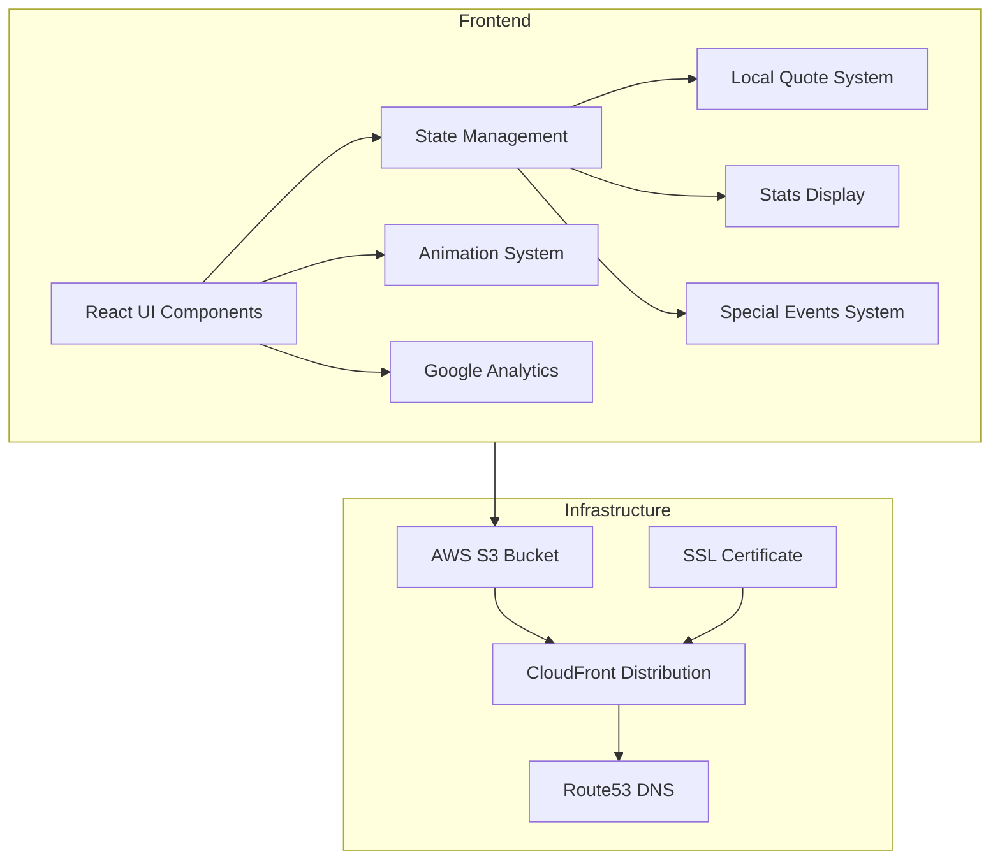
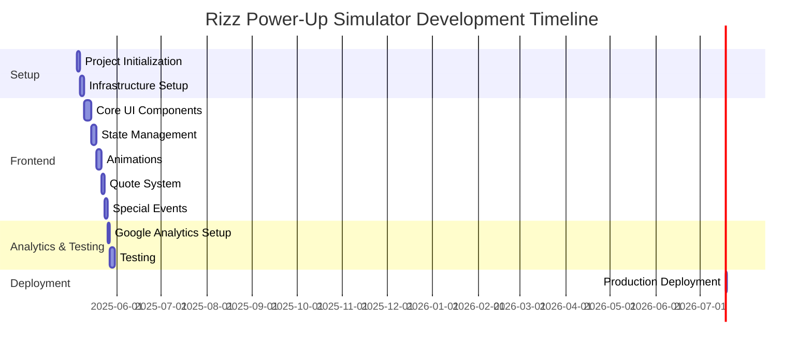

# Rizz Power-Up Simulator - Project Implementation Plan

## 1. Project Overview

The Rizz Power-Up Simulator is a vaporwave-style mobile web app that allows users to tap a button to increase their "Rizz" (charisma) level. With each tap, users receive a "Rizz Quote" from a predefined set and see their stats increase by a fixed amount.

### Key Requirements from PRD:
- Mobile-first game that users can interact with in under 1 minute
- Use humor, AI, and pop culture to retain attention
- Optimize for virality with screenshot/share flows
- Vaporwave aesthetic with engaging animations

### Key Decisions Based on Feedback:
- User progress will be stored locally using localStorage
- Quotes will come from a predefined set stored locally (no API costs)
- Special events will occur at fixed intervals every 10 taps
- Hybrid vaporwave aesthetic with clean base design and glitchy effects during special events
- No sound effects or background music
- All stats increase by a fixed amount with each tap
- No custom screenshot functionality (device will handle it natively)
- Implement basic analytics with Google Analytics

## 2. Technical Architecture

## 3. Frontend Implementation Plan

### 3.1 Project Setup
- Initialize a new TypeScript React project in apps/frontend
- Configure TailwindCSS with vaporwave-inspired theme
- Set up project structure following best practices
- Configure Google Analytics

### 3.2 Core Components
- **Main Game Screen**: Central hub with Rizz button, quote display, and stats panel
- **Rizz Button**: Primary interaction point with animations
- **Quote Display**: Shows quotes from predefined set
- **Stats Panel**: Displays user stats (Vibe Level, Swagger, Cringe Avoidance, Rizz Level)
- **Special Event Cards**: Appear every 10 taps with glitchy effects
- **Menu**: Settings and about section

### 3.3 State Management
- Implement state management for:
  - Rizz level counter
  - User stats
  - Quote selection
  - Special events tracking
  - Settings
- Use localStorage for session persistence

### 3.4 Animation System
- Implement animations for:
  - Button interactions (glow, press effects)
  - Stat updates
  - Quote transitions
  - Special events with glitchy effects
- Use CSS animations and potentially a library like Framer Motion

### 3.5 Quote System
- Create a large database of predefined quotes
- Implement a selection system that avoids repetition
- Store quotes in a JSON file or similar structure

## 4. Infrastructure Setup

### 4.1 AWS Configuration
- Configure AWS profile for "rizz-power-up" using provided access keys
- Update infrastructure files:
  - Modify S3 bucket configuration
  - Update CloudFront distribution settings
  - Configure Route53 DNS records
  - Set up SSL certificate

### 4.2 CI/CD Pipeline
- Update GitHub Actions workflows:
  - Infrastructure deployment workflow
  - Application build and deployment workflow
  - Cache invalidation process

## 5. Analytics Implementation
- Set up Google Analytics
- Track key events:
  - Button taps
  - Special events triggered
  - Session length
  - Return visits

## 6. Testing Strategy

### 6.1 Frontend Testing
- Unit tests for core functionality
- Component tests for UI elements
- End-to-end tests for critical user flows
- eslint for code quality and error catching before committing

### 6.2 Mobile Testing
- Test on various mobile devices and screen sizes
- Verify touch interactions and animations
- Ensure performance is acceptable on lower-end devices

## 7. Deployment Strategy

### 7.1 Production Deployment
- Configure production environment
- Set up monitoring and analytics
- Implement error tracking

## 8. Timeline and Milestones

## 9. Added Tasks

The following new tasks have been added to the TODO.md file:

### Frontend Tasks
- Create a vaporwave-inspired TailwindCSS theme
- Design and implement the main game screen with Rizz button
- Create a database of predefined Rizz quotes (at least 100 unique quotes)
- Implement local storage for saving user progress
- Implement stats system (Vibe Level, Swagger, Cringe Avoidance, Rizz Level)
- Create special events system that triggers every 10 taps
- Implement hybrid visual style (clean base with glitchy effects during special events)
- Set up Google Analytics for basic user engagement tracking

### Infrastructure Tasks
- Update S3 bucket configuration for rizz-power-up
- Configure CloudFront distribution for the new app
- Set up Route53 DNS records
- Configure SSL certificate
- Test the infrastructure deployment

### Testing Tasks
- Test the app on various mobile devices and screen sizes
- Verify that local storage works correctly for saving progress
- Test special events system
- Verify analytics tracking is working properly