# R1zz P0w3r-Up S1mul4t0r - Pr0j3ct 1mpl3m3nt4t10n Pl4n 🚀

## 1. Pr0j3ct 0v3rv13w 🔍

The R1zz P0w3r-Up S1mul4t0r is a vaporwave-style mobile web app that allows users to tap a button to increase their "Rizz" (charisma) level. With each tap, users receive a "Rizz Quote" from a predefined set and see their stats increase by a fixed amount.

### K3y R3qu1r3m3nts fr0m PRD: 📋
- Mobile-first game that users can interact with in under 1 minute
- Use humor, AI, and pop culture to retain attention
- Optimize for virality with screenshot/share flows
- Vaporwave aesthetic with engaging animations

### K3y D3c1s10ns B4s3d 0n F33db4ck: 🧠
- User progress will be stored locally using localStorage
- Quotes will come from a predefined set stored locally (no API costs)
- Special events will occur at fixed intervals every 10 taps
- Hybrid vaporwave aesthetic with clean base design and glitchy effects during special events
- No sound effects or background music
- All stats increase by a fixed amount with each tap
- No custom screenshot functionality (device will handle it natively)
- Implement basic analytics with Google Analytics

## 2. T3chn1c4l 4rch1t3ctur3 ⚙️

```mermaid
%%{init: {'theme': 'base', 'themeVariables': { 'primaryColor': '#9B5DE5', 'primaryTextColor': '#fff', 'primaryBorderColor': '#7C3AEF', 'lineColor': '#00F5D4', 'secondaryColor': '#F15BB5', 'tertiaryColor': '#00BBF9' }}}%%
flowchart TD
    subgraph Frontend
        UI[🎮 React UI Components]
        State[💾 State Management]
        Animations[✨ Animation System]
        QuoteSystem[💬 Local Quote System]
        StatsDisplay[📊 Stats Display]
        SpecialEvents[🌟 Special Events System]
        Analytics[📈 Google Analytics]
    end
    
    subgraph Infrastructure
        S3[🗄️ AWS S3 Bucket]
        CloudFront[☁️ CloudFront Distribution]
        Route53[🌐 Route53 DNS]
        ACM[🔒 SSL Certificate]
    end
    
    UI --> State
    State --> QuoteSystem
    State --> StatsDisplay
    State --> SpecialEvents
    UI --> Animations
    UI --> Analytics
    
    Frontend --> S3
    S3 --> CloudFront
    CloudFront --> Route53
    ACM --> CloudFront
    
    style UI fill:#9B5DE5,stroke:#333,stroke-width:2px
    style State fill:#9B5DE5,stroke:#333,stroke-width:2px
    style Animations fill:#F15BB5,stroke:#333,stroke-width:2px
    style QuoteSystem fill:#F15BB5,stroke:#333,stroke-width:2px
    style StatsDisplay fill:#F15BB5,stroke:#333,stroke-width:2px
    style SpecialEvents fill:#F15BB5,stroke:#333,stroke-width:2px
    style Analytics fill:#00BBF9,stroke:#333,stroke-width:2px
    style S3 fill:#00BBF9,stroke:#333,stroke-width:2px
    style CloudFront fill:#00BBF9,stroke:#333,stroke-width:2px
    style Route53 fill:#00BBF9,stroke:#333,stroke-width:2px
    style ACM fill:#00BBF9,stroke:#333,stroke-width:2px
```

## 3. Fr0nt3nd 1mpl3m3nt4t10n Pl4n 💻

### 3.1 Pr0j3ct S3tup 🏗️
- Initialize a new TypeScript React project in apps/frontend
- Configure TailwindCSS with vaporwave-inspired theme
- Set up project structure following best practices
- Configure Google Analytics

### 3.2 C0r3 C0mp0n3nts 🧩
- **Main Game Screen**: Central hub with Rizz button, quote display, and stats panel
- **Rizz Button**: Primary interaction point with animations
- **Quote Display**: Shows quotes from predefined set
- **Stats Panel**: Displays user stats (Vibe Level, Swagger, Cringe Avoidance, Rizz Level)
- **Special Event Cards**: Appear every 10 taps with glitchy effects
- **Menu**: Settings and about section

### 3.3 St4t3 M4n4g3m3nt 💾
- Implement state management for:
  - Rizz level counter
  - User stats
  - Quote selection
  - Special events tracking
  - Settings
- Use localStorage for session persistence

### 3.4 4n1m4t10n Syst3m ✨
- Implement animations for:
  - Button interactions (glow, press effects)
  - Stat updates
  - Quote transitions
  - Special events with glitchy effects
- Use CSS animations and potentially a library like Framer Motion

### 3.5 Qu0t3 Syst3m 💬
- Create a large database of predefined quotes
- Implement a selection system that avoids repetition
- Store quotes in a JSON file or similar structure

## 4. 1nfr4structur3 S3tup ☁️

### 4.1 4WS C0nf1gur4t10n 🔧
- Configure AWS profile for "rizz-power-up" using provided access keys
- Update infrastructure files:
  - Modify S3 bucket configuration
  - Update CloudFront distribution settings
  - Configure Route53 DNS records
  - Set up SSL certificate

### 4.2 C1/CD P1p3l1n3 🔄
- Update GitHub Actions workflows:
  - Infrastructure deployment workflow
  - Application build and deployment workflow
  - Cache invalidation process

## 5. 4n4lyt1cs 1mpl3m3nt4t10n 📊
- Set up Google Analyticsp
- Track key events:
  - Button taps
  - Special events triggered
  - Session length
  - Return visits

## 6. T3st1ng Str4t3gy 🧪

### 6.1 Fr0nt3nd T3st1ng 🔍
- Unit tests for core functionality
- Component tests for UI elements
- End-to-end tests for critical user flows
- eslint for code quality and error catching before committing

### 6.2 M0b1l3 T3st1ng 📱
- Test on various mobile devices and screen sizes
- Verify touch interactions and animations
- Ensure performance is acceptable on lower-end devices

## 7. D3pl0ym3nt Str4t3gy 🚀

### 7.1 Pr0duct10n D3pl0ym3nt 🌐
- Configure production environment
- Set up monitoring and analytics
- Implement error tracking

## 8. T1m3l1n3 4nd M1l3st0n3s ⏱️

## 9. 4dd3d T4sks 📝

The following new tasks have been added to the TODO.md file:

### Fr0nt3nd T4sks 💻
- Create a vaporwave-inspired TailwindCSS theme
- Design and implement the main game screen with Rizz button
- Create a database of predefined Rizz quotes (at least 100 unique quotes)
- Implement local storage for saving user progress
- Implement stats system (Vibe Level, Swagger, Cringe Avoidance, Rizz Level)
- Create special events system that triggers every 10 taps
- Implement hybrid visual style (clean base with glitchy effects during special events)
- Set up Google Analytics for basic user engagement tracking

### 1nfr4structur3 T4sks ☁️
- Update S3 bucket configuration for rizz-power-up
- Configure CloudFront distribution for the new app
- Set up Route53 DNS records
- Configure SSL certificate
- Test the infrastructure deployment

### T3st1ng T4sks 🧪
- Test the app on various mobile devices and screen sizes
- Verify that local storage works correctly for saving progress
- Test special events system
- Verify analytics tracking is working properly

---

*Crafted with conscious code & single-origin coffee* ☕✨

## 📚 Documentation

For complete project documentation, please see the [Table of Contents](./TOC.md) which provides links to all documentation files in this project.