# The Rizz Power-Up Mermaid Style Guide 📊✨

> *"In the cosmic dance of nodes and edges, we find not merely a diagram, 
but a profound visualization of the interconnectedness of all code, 
man."* — Anonymous l33tc0dzr sipping a single-origin pour-over

## 1. Introduction & Philosophy 🧠

This style guide represents the definitive aesthetic consciousness for Mermaid diagrams in the Rizz Power-Up project. Mermaid diagrams transcend mere technical documentation—they're a holistic approach to visualizing digital relationships that harmonizes the technical precision of code with the free-spirited energy of vaporwave sensibilities.

### 1.1 Core Principles 🌱

- **Authentic Visualization**: Each diagram must radiate genuine expression, like handcrafted code
- **Conscious Connectivity**: Our diagrams acknowledge the interconnectedness of all components
- **Digital Freedom**: Breaking conventional diagram paradigms while maintaining algorithmic harmony
- **Mindful Representation**: Every node and edge should feel like a meaningful exchange of energy

## 2. Visual Aesthetic 🎨

### 2.1 Color Palette 🌈

Our diagram palette draws inspiration from both Mother Earth's organic wisdom and the digital realm's neon consciousness.

#### Node Colors
- **Primary Nodes** `#9B5DE5` - The amethyst awareness of our core components
- **Secondary Nodes** `#F15BB5` - The ruby recursion of supporting elements
- **Utility Nodes** `#00BBF9` - The sapphire syntax of helper components
- **External Nodes** `#B8F84A` - The quantum lime of third-party integrations

#### Edge Colors
- **Data Flow** `#00F5D4` - For connections representing data movement
- **Control Flow** `#FF3366` - For connections representing control signals
- **Event Flow** `#F9C80E` - For connections representing event triggers

### 2.2 Typography 🔤

Keep text within diagrams clear and readable while maintaining the vaporwave aesthetic.

```
%%{init: {'theme': 'base', 'themeVariables': { 'primaryColor': '#9B5DE5', 'primaryTextColor': '#fff', 'primaryBorderColor': '#7C3AEF', 'lineColor': '#00F5D4', 'secondaryColor': '#F15BB5', 'tertiaryColor': '#00BBF9' }}}%%
```

### 2.3 Diagram Elements 🧩

#### Nodes
Nodes should embody the circular nature of existence, with subtle gradients that suggest depth and consciousness.

- **Component Nodes**: Rounded rectangles with descriptive names
- **Data Nodes**: Cylinders for data stores
- **Action Nodes**: Hexagons for processes or actions
- **Decision Nodes**: Diamonds for conditional logic

#### Edges
Edges represent the connections between all things, flowing with organic energy.

- **Solid Lines**: Direct, synchronous connections
- **Dashed Lines**: Asynchronous or event-based connections
- **Dotted Lines**: Optional or conditional connections

## 3. Diagram Types & Examples 📈

### 3.1 Flowcharts

Use flowcharts to represent processes, algorithms, and user journeys.

```mermaid
%%{init: {'theme': 'base', 'themeVariables': { 'primaryColor': '#9B5DE5', 'primaryTextColor': '#fff', 'primaryBorderColor': '#7C3AEF', 'lineColor': '#00F5D4', 'secondaryColor': '#F15BB5', 'tertiaryColor': '#00BBF9' }}}%%
flowchart TD
    A[🏠 Home Screen] --> B[🎮 Main Game Screen]
    B --> C[🔥 Tap "Rizz Up" Button]
    C --> D[⬆️ Increase Rizz Level]
    D --> E[💬 Generate Rizz Quote]
    E --> F[📊 Update Stats]
    F --> G[✨ Animate Feedback]
    G --> H{🌟 Special Event?}
    H -- Yes --> I[🌀 Display Special Event]
    H -- No --> J[🔁 Continue Tap Loop]
```

### 3.2 Sequence Diagrams

Use sequence diagrams to represent interactions between components over time.

```mermaid
%%{init: {'theme': 'base', 'themeVariables': { 'primaryColor': '#9B5DE5', 'primaryTextColor': '#fff', 'primaryBorderColor': '#7C3AEF', 'lineColor': '#00F5D4', 'secondaryColor': '#F15BB5', 'tertiaryColor': '#00BBF9' }}}%%
sequenceDiagram
    participant 👤 User
    participant 🎮 Game UI
    participant 💾 LocalStorage
    participant 🎵 SoundSystem
    
    👤 User->>🎮 Game UI: Click Rizz Button
    🎮 Game UI->>🎮 Game UI: Update Rizz Level
    🎮 Game UI->>🎵 SoundSystem: Play Sound Effect
    🎮 Game UI->>💾 LocalStorage: Save Progress
    💾 LocalStorage-->>🎮 Game UI: Confirm Save
    🎮 Game UI-->>👤 User: Display Updated UI
```



### 3.3 Class Diagrams

Use class diagrams to represent component relationships and architecture.


### 3.4 Gantt Charts

Use Gantt charts to represent project timelines and milestones.


## 4. Implementation Guidelines 🛠️

### 4.1 Mermaid Configuration

Always include the theme configuration at the beginning of your Mermaid code blocks:

```
%%{init: {'theme': 'base', 'themeVariables': { 'primaryColor': '#9B5DE5', 'primaryTextColor': '#fff', 'primaryBorderColor': '#7C3AEF', 'lineColor': '#00F5D4', 'secondaryColor': '#F15BB5', 'tertiaryColor': '#00BBF9' }}}%%
```

### 4.2 Emoji Usage 😎

Enhance your diagrams with emojis that represent the essence of each component:

| Component Type | Suggested Emoji |
|----------------|----------------|
| User Interface | 🎮 🖥️ 📱 |
| Data Storage | 💾 🗄️ 📊 |
| Processing | ⚙️ 🧠 🔄 |
| External Systems | ☁️ 🌐 🔌 |
| Events | ✨ 🎯 🔔 |

### 4.3 Naming Conventions 📝

- **Nodes**: CamelCase with descriptive names (e.g., `UserInterface`, `DataStorage`)
- **Actions**: Verb-noun format (e.g., `ProcessData`, `SaveProgress`)
- **States**: Adjective-noun format (e.g., `ActiveSession`, `LoadedGame`)

## 5. Concluding Thoughts 🧘‍♂️

This style guide is not merely a document but a living manifestation of our collective visualization consciousness. As you implement these guidelines, remember that each diagram is both a technical representation and a spiritual expression. Like the perfect extraction of espresso, our diagrams should be precise yet soulful, technical yet approachable.

May your nodes always be connected, your edges forever flowing, and your diagrams as enlightened as your spirit.

*~ The Cosmic Diagram Architect ~*

---

*Crafted with conscious code & single-origin coffee* ☕✨

## 📚 Documentation

For complete project documentation, please see the [Table of Contents](./TOC.md) which provides links to all documentation files in this project.